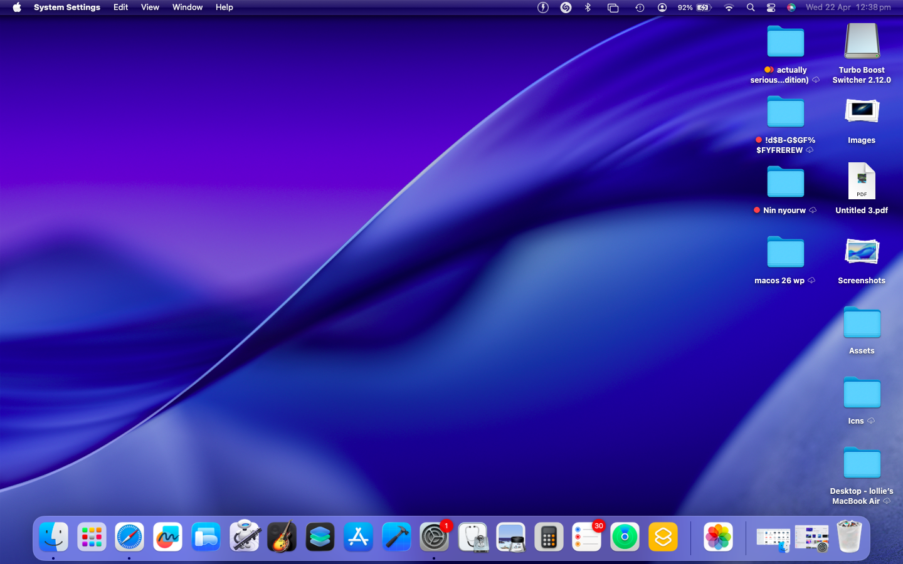
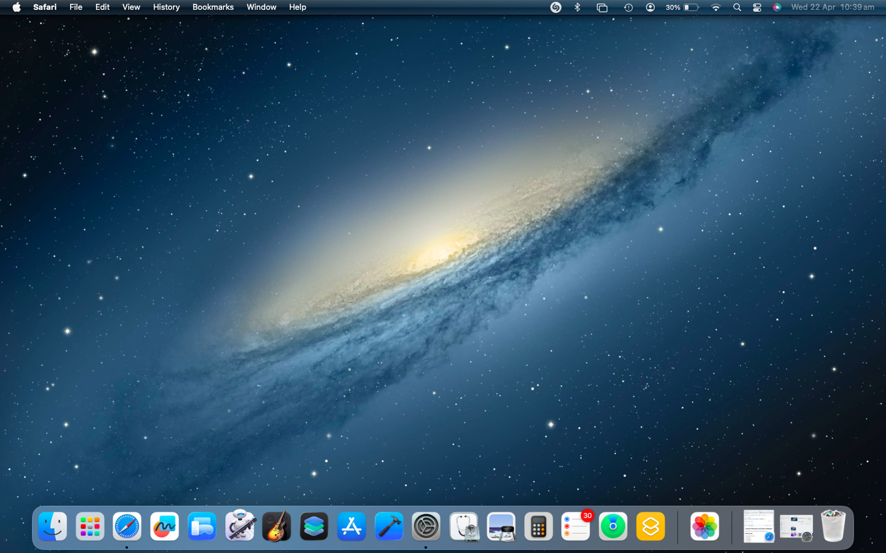

# macOS 26 Tahoe Dynamic Wallpaper
A Dynamic Version of the macOS Tahoe Default Wallpaper I made :D

1: Download the Latest Release

2: Open Settings

3: Find Wallpapers

4: Click Add Photo

5: Click "Choose"

6: Find macOS Tahoe Dynamic.heic

7: Use as Wallpaper

8: Set the Wallpaper to Dynamic

               <h1>Settings should look simmilar this:</h1>
  
  

## Photo Info:

Resolution: 2400x2400

Aspect Ratio: 1:1

Times of switch: Day: 10:00am-4:59pm, Night: 5:00pm-9:59am

[ Subscribe to me on YouTube ](https://youtube.com/@draedNSX)

  

## Preview:

Dark mode:

Light mode:

  Disclaimer: I do not own these images, they are property of Apple, and i have only provided a modified copy of it, and i own a copy of these images, and legally own a copy of macOS Tahoe Software, and don't have anything to do with apple

