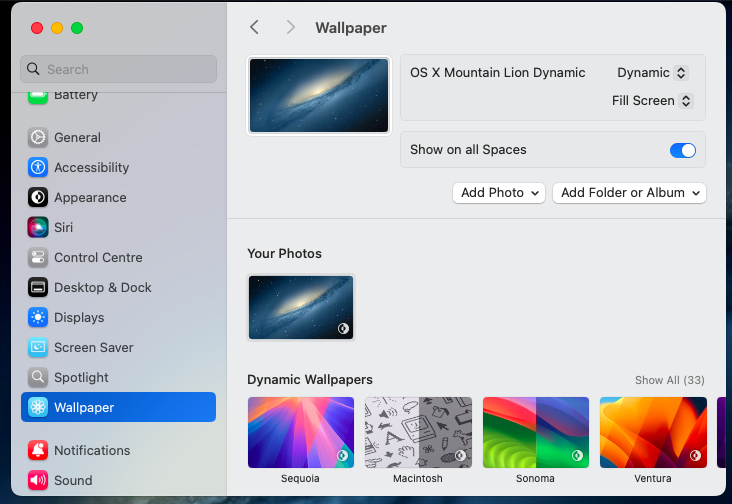

# macOS X Mountain Lion Dynamic Wallpaper
A Dynamic Version of the OS X Mountain Lion Default Wallpaper I made :D

  <f1> I Personally Recoomend installing Lickable Menu Bar from the App Store, If you want the MacOS X Aesthetic</f1>

# How to use:
1: Download the Latest Release

2: Open Settings

3: Find Wallpapers

4: Click Add Photo

5: Click "Choose"

6: Find OS X Mountain Lion Dynamic.heic

7: Use as Wallpaper

8: Set the Wallpaper to Dynamic

               <h1>Settings should look like this:</h1>
             

Disclaimer: I do not own these images, they are property of Apple, and i have only provided a modified copy of it, and i own a copy of these images, and legally own a copy of macOS X 10.8 Software, and don't have anything to do with apple
